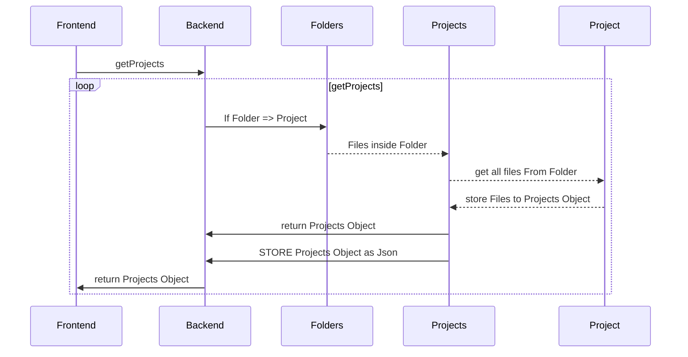

# Flowy Backend Server

## Express

the backend server is written in express.
i can be started with

```
node index.js
```



```mermaid

sequenceDiagram
    participant Frontend
    participant Backend
    Frontend->>Backend: getProjects

    loop getProjects
        Backend->>Folders: If Folder => Project
        Folders-->>Projects: Files inside Folder
        Projects-->>Project: get all files From Folder
        Project-->>Projects: store Files to Projects Object
        Projects->>Backend: return Projects Object
        Projects->>Backend: STORE Projects Object as Json
        Backend->>Frontend: return Projects Object
    end


```
